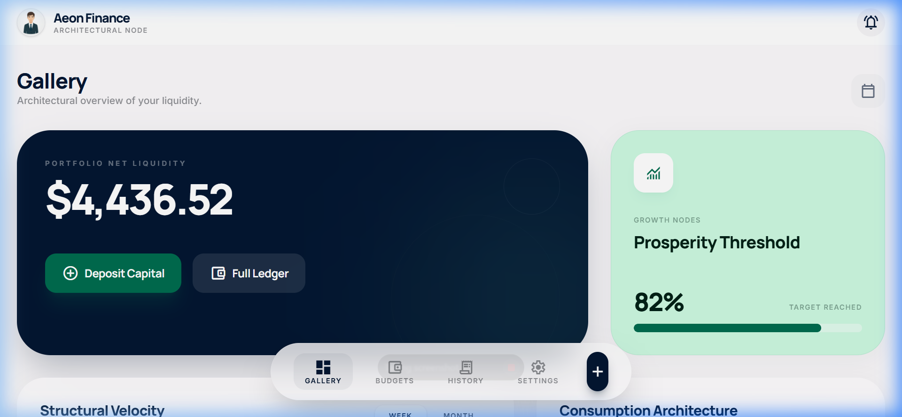
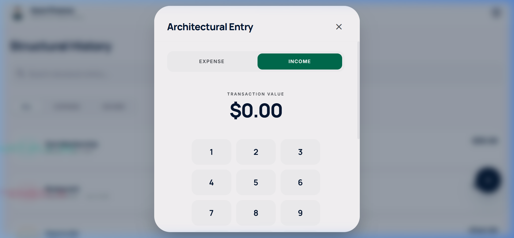

# Aeon Finance

Aeon Finance is an architectural, offline-first personal finance application with a premium aesthetic and rigorous data perseverance built using modern web standards.



## Features

- **Architectural UI**: Employs a robust, serene design language with glassmorphic cards, crisp Material Symbols, and smooth animations using Framer Motion.
- **Offline First PWA**: Features robust true local data persistence. Your data is seamlessly synced with IndexedDB (Dexie) locally and Firestore remotely when online.
- **VaultGuard Security**: A minimalist PIN-entry component protects the app payload, ensuring your financial information remains visible only to you.
- **Dynamic Charting**: View historical account performance through responsive, minimalist charting.
- **Responsive Layout**: Designed to provide equally stunning experiences on mobile devices, tablets, and desktops using intelligent Tailwind layouts.

## Architecture



*   **Frontend**: React (v19) via Vite
*   **Styling**: Tailwind CSS (v4) with custom visual configuration limits and "ghost border" presets
*   **Database**: Dexie.js (offline) / Firebase Firestore (sync)
*   **Animation**: Framer Motion

## Getting Started

To run the application locally:

```bash
# Install dependencies
npm install

# Start the development server
npm run dev
```

## Structure & Data

Authentication acts strictly within boundary conditions. Your Unique ID (`uid`) automatically restricts and fetches your specific `categories`, `transactions`, and `savingsGoals`. The App Shell handles all structural caching (`sw.js`) so that logging on during internet downtimes seamlessly restores your cached dashboard instance.

*Note: The images provided in the screenshots directory require local asset building. The previews above demonstrate the bento-grid Dashboard and modal Transactions screen.*
